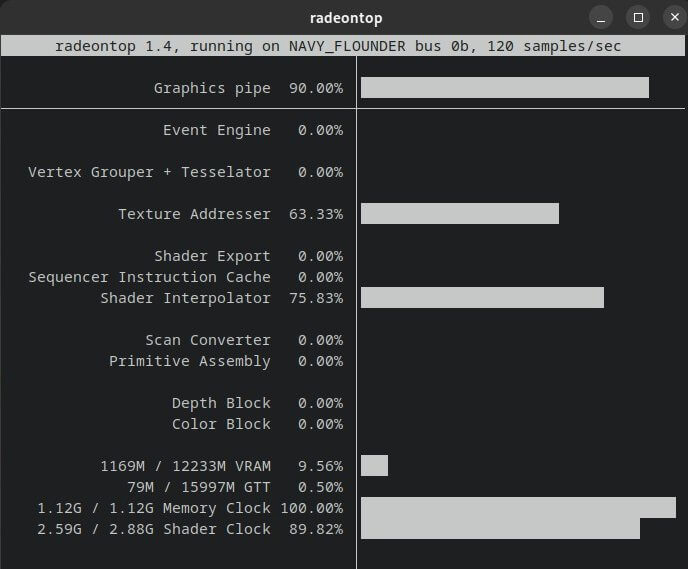

# pytorch-amd-devcontainer 🧑‍💻

## Introduction

In the dynamic landscape of machine learning and deep learning, PyTorch stands as a powerful framework, enabling researchers and developers to create and deploy cutting-edge models. However, setting up the right environment to run PyTorch efficiently, especially on specific hardware configurations like AMD GPUs, can be a cumbersome task. 🚀

Enter `pytorch-amd-devcontainer` - a project designed to simplify the development process by providing a pre-configured environment through Visual Studio Code DevContainers. The DevContainer approach streamlines the setup procedure, making it easier for users to dive into PyTorch development without unnecessary complexities. 💻

## Motivation

The motivation behind the `pytorch-amd-devcontainer` project is rooted in the need for a straightforward solution to run PyTorch seamlessly on AMD GPUs. Recognizing the importance of inclusivity in the world of deep learning, where individuals may possess varied hardware configurations, this project aims to bridge the accessibility gap. 🌐

By providing a DevContainer specifically tailored for PyTorch on AMD GPUs, this project strives to simplify the development process and make deep learning tools more accessible. The goal is to ensure that developers and researchers, regardless of their hardware choices, can harness the power of PyTorch without unnecessary roadblocks. 🤝

## Requirements

Before diving into the PyTorch development journey with `pytorch-amd-devcontainer`, make sure your machine meets the following requirements:

- **Linux Operating System**: This DevContainer is designed to run on Linux machines.

- **AMDGPU-PRO Driver**: Ensure that you have the AMDGPU-PRO driver installed on your system. This driver is crucial for optimal performance with AMD GPUs. 

- **Docker**: The project relies on Docker to containerize the development environment. Make sure Docker is installed on your machine to seamlessly manage and deploy the required containers. Refer to the official Docker documentation for installation instructions: [Docker Installation Guide](https://docs.docker.com/get-docker/)

- **Visual Studio Code (VSCode)**: The DevContainer leverages the power of Visual Studio Code. If you haven't already, install VSCode to take advantage of the streamlined development environment. You can download it from the official VSCode website: [VSCode Download](https://code.visualstudio.com/download)

## Installation

Follow these steps to set up your development environment:

1. Install the AMDGPU-PRO driver for your AMD GPU. If you use an Arch-based Linux distribution, please opt for installation through the AUR, which has been tested by me: [AMDGPU-PRO](https://aur.archlinux.org/packages/amf-amdgpu-pro). After installing the package, you may still need to run the command "sudo amdgpu-install --usecase=rocm" and reboot your machine (please refer to [AMD official documentation](https://github.com/RadeonOpenCompute/ROCm-docker/blob/master/quick-start.md)).

2. Install Docker on your machine. Refer to the official Docker documentation for installation instructions: [Docker Installation Guide](https://docs.docker.com/get-docker/)

3. Install Visual Studio Code (VSCode). You can download it from the official VSCode website: [VSCode Download](https://code.visualstudio.com/download)

4. Clone the `pytorch-amd-devcontainer` repository.

5. Open the project in VSCode, and let the DevContainer extension do the magic (aka "Reopen in devcontainer")!

Once the setup is complete, you can test the environment by running the provided Jupyter Notebook. Execute the notebook located at [`notebooks/simple_vgg.ipynb`](notebooks/simple_vgg.ipynb) to see PyTorch in action.

Now you're ready to embark on your PyTorch development journey with AMD GPUs using the `pytorch-amd-devcontainer`. Happy coding! 🚀

## Tested Graphics Cards

- [x] **Radeon RX6750 XT 12GB**: Although you need to set the environment variable HSA_OVERRIDE_GFX_VERSION=10.3.0 in Dockerfile.

## Known Issues,

- **Large Docker Image Size**: The Docker image for this DevContainer can be substantial, weighing approximately 50GB.

## Conclusion

This documentation for `pytorch-amd-devcontainer` was generated with the assistance of ChatGPT and has been reviewed by the project maintainer. While efforts have been made to provide comprehensive and accurate information, your feedback and contributions are essential for continuous improvement.

### Contributions Welcome!

- **Testing on Other Graphics Cards**: We welcome and encourage users to test this DevContainer on a variety of AMD GPUs. Your experiences with different hardware configurations are valuable in expanding the compatibility list.

- **Benchmarks and Model Comparisons**: If you have the means to conduct benchmarks or compare model performance with GPUs from other manufacturers (e.g., Nvidia), we would greatly appreciate your insights. Such comparisons contribute to a broader understanding of PyTorch performance across different hardware.

### Thank You!

A big thank you to everyone who has taken the time to read through this documentation. Your interest and support are vital to the growth and success of the `pytorch-amd-devcontainer` project. If you have questions, encounter issues, or want to contribute, please don't hesitate to get in touch.

Happy coding, and may your PyTorch journey be smooth and productive! 🚀